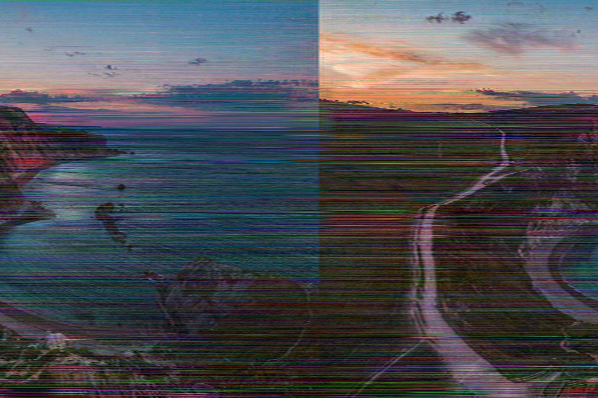
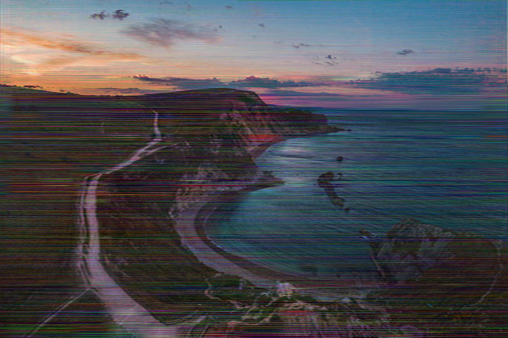

# Addendum: Automated image to audio 'bending

(This is an addendum to *[(Ab)using Lossy Audio Compression to Databend Images](https://github.com/multiplealiases/Databending-In-Audacity-Required-Reading/blob/main/README.md)*.)

This is definitely something I should've done a long time ago, considering the long and tedious commands needed to do this. This more-or-less supersedes the old method of typing in 4 complex commands into the terminal, but I'll keep it in there for posterity and understanding.

Here it is! It's called [I2A2I.py](scripts/I2A2I.py), because I'm creatively bankrupt. For the second time, if we're going by chronological order of when I wrote these articles. I like to think it documents itself, but I'll go through one image so that you know I'm not giving you a virus or something.

Download the script (desktop users: go to "Raw", Ctrl+S to save webpage), and just run it on its own. Just do:

~~~
python I2A2I.py
~~~

And assuming you have FFmpeg in PATH, you'll see:

~~~
Usage: I2A2I.py [resolution] [filename w/ extension] [audio codec] [bitrate] [internal pixel format]
The internal pixel format should be "rgb24" for interleaved 24-bit RGB, and "gbrp" for planar 24-bit RGB.
However, no checking is done, so go wild!
~~~

Which should be fairly self-explanatory. Let's pull out the lab rat for today:

[Photo](https://unsplash.com/photos/9NAIl5DKfVU) by [Jack B](https://unsplash.com/@nervum) on [Unsplash](https://unsplash.com/)

(assets/images/sunrise-shot.jpg)

Run

~~~
I2A2I.py 1920x1279 sunrise-shot.jpg aac 16k gbrp
~~~

(assets/images/sunrise-shot-end-aac-16k-gbrp.jpg)

It's a bit off-center, yes. You'll have to do a bit of editing to get it to be centered. Here's the edit of that: 

(assets/images/sunrise-shot-end-aac-16k-gbrp-edit.jpg)

That's better. In general, the only parameter you can't change willy-nilly (because it's related to the output image) is the resolution parameter.

## Protip

Use `ffmpeg -codecs` to find the codecs it supports. Then, filter the results through `grep` or `findstr` to get the ones you want. Thankfully, FFmpeg has this use case in mind. When you invoke that command, it starts off with a list:

~~~
Codecs:
 D..... = Decoding supported
 .E.... = Encoding supported
 ..V... = Video codec
 ..A... = Audio codec
 ..S... = Subtitle codec
 ...I.. = Intra frame-only codec
 ....L. = Lossy compression
 .....S = Lossless compression
~~~

So what we want to find is decode + encode supported, audio codec, and lossy compression. This is equal to DEA.L in FFmpeg's notation. For Windows, run:

~~~
ffmpeg -codecs | findstr DEA.L
~~~

and for Linux, run:

~~~
ffmpeg -codecs | grep DEA.L
~~~

On Ubuntu 20.04 (WSL), this yields:

~~~
 DEA.L. aac                  AAC (Advanced Audio Coding) (decoders: aac aac_fixed )
 DEA.L. ac3                  ATSC A/52A (AC-3) (decoders: ac3 ac3_fixed ) (encoders: ac3 ac3_fixed )
 DEA.L. adpcm_adx            SEGA CRI ADX ADPCM
 DEA.L. adpcm_g722           G.722 ADPCM (decoders: g722 ) (encoders: g722 )
 DEA.L. adpcm_g726           G.726 ADPCM (decoders: g726 ) (encoders: g726 )
 DEA.L. adpcm_g726le         G.726 ADPCM little-endian (decoders: g726le ) (encoders: g726le )
 DEA.L. adpcm_ima_qt         ADPCM IMA QuickTime
 DEA.L. adpcm_ima_wav        ADPCM IMA WAV
 DEA.L. adpcm_ms             ADPCM Microsoft
 DEA.L. adpcm_swf            ADPCM Shockwave Flash
 DEA.L. adpcm_yamaha         ADPCM Yamaha
 DEA.L. aptx                 aptX (Audio Processing Technology for Bluetooth)
 DEA.L. aptx_hd              aptX HD (Audio Processing Technology for Bluetooth)
 DEA.L. codec2               codec2 (very low bitrate speech codec) (decoders: libcodec2 ) (encoders: libcodec2 )
 DEA.L. comfortnoise         RFC 3389 Comfort Noise
 DEA.LS dts                  DCA (DTS Coherent Acoustics) (decoders: dca ) (encoders: dca )
 DEA.L. eac3                 ATSC A/52B (AC-3, E-AC-3)
 DEA.L. g723_1               G.723.1
 DEA.L. gsm                  GSM (decoders: gsm libgsm ) (encoders: libgsm )
 DEA.L. gsm_ms               GSM Microsoft variant (decoders: gsm_ms libgsm_ms ) (encoders: libgsm_ms )
 DEA.L. mp2                  MP2 (MPEG audio layer 2) (decoders: mp2 mp2float ) (encoders: mp2 mp2fixed libtwolame )
 DEA.L. mp3                  MP3 (MPEG audio layer 3) (decoders: mp3float mp3 ) (encoders: libmp3lame libshine )
 DEA.L. nellymoser           Nellymoser Asao
 DEA.L. opus                 Opus (Opus Interactive Audio Codec) (decoders: opus libopus ) (encoders: opus libopus )
 DEA.L. pcm_alaw             PCM A-law / G.711 A-law
 DEA.L. pcm_mulaw            PCM mu-law / G.711 mu-law
 DEA.L. pcm_vidc             PCM Archimedes VIDC
 DEA.L. ra_144               RealAudio 1.0 (14.4K) (decoders: real_144 ) (encoders: real_144 )
 DEA.L. roq_dpcm             DPCM id RoQ
 DEA.L. sbc                  SBC (low-complexity subband codec)
 DEA.L. speex                Speex (decoders: libspeex ) (encoders: libspeex )
 DEA.L. vorbis               Vorbis (decoders: vorbis libvorbis ) (encoders: vorbis libvorbis )
 DEAILS wavpack              WavPack (encoders: wavpack libwavpack )
 DEA.L. wmav1                Windows Media Audio 1
 DEA.L. wmav2                Windows Media Audio 2
~~~

Many of these codecs won't work with this current script, but at least some of these should. It's usually the sampling rate that's at fault, second being the extension of the Step 2 file. Go and dive into the script for that; the variables you want to change are `sample_rate` and `step2_out_extension` respectively. Some of them will work, but will silently downsample the internal audio down to a lower sampling rate. It's also worth pointing out that the minimum bitrate is a thing; lots of these codecs don't even try running at anything lower than 32 kbps. 

It's all a bit of a mess, frankly.

---
This work (and all files within the folder `/assets` and all of its subdirectories recursively) is licensed under a
[Creative Commons Attribution 4.0 International License][cc-by]
except where stated otherwise. See the file `LICENSE-CC-BY.txt` for details.

[![CC BY 4.0][cc-by-image]][cc-by]

The code in this repository (defined as all files under the folder `/scripts` and all of its subdirectories recursively) is licensed under an
MIT License
except where stated otherwise. See the file `LICENSE-MIT.txt` for details.

[cc-by]: http://creativecommons.org/licenses/by/4.0/
[cc-by-image]: https://i.creativecommons.org/l/by/4.0/88x31.png
